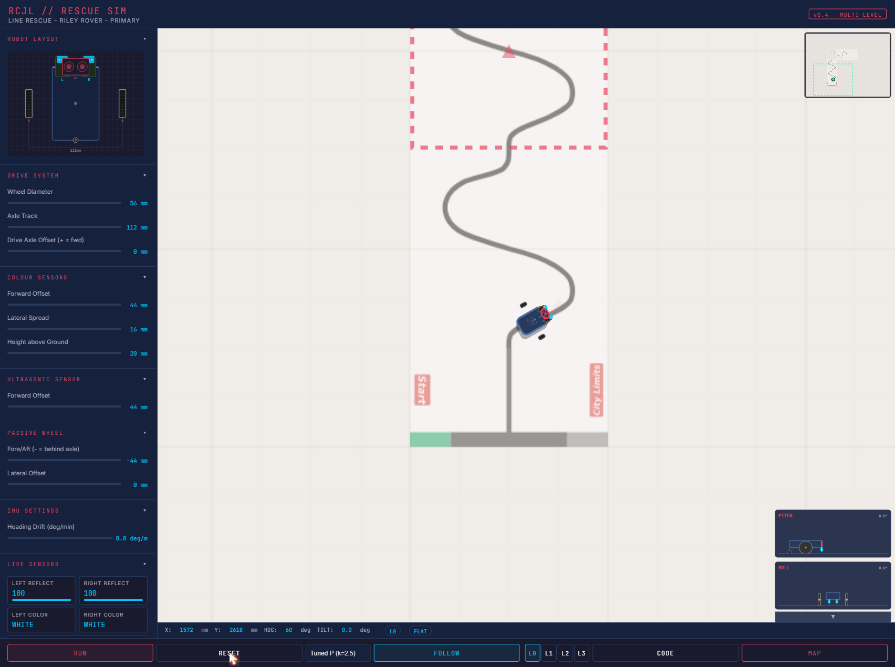
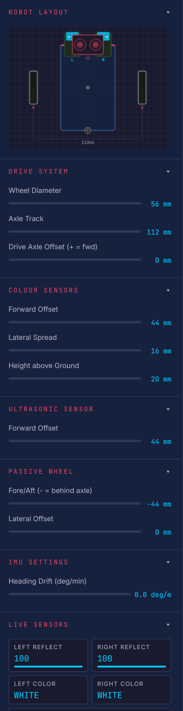
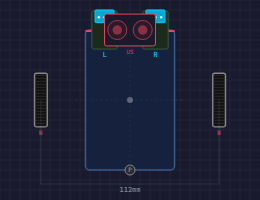
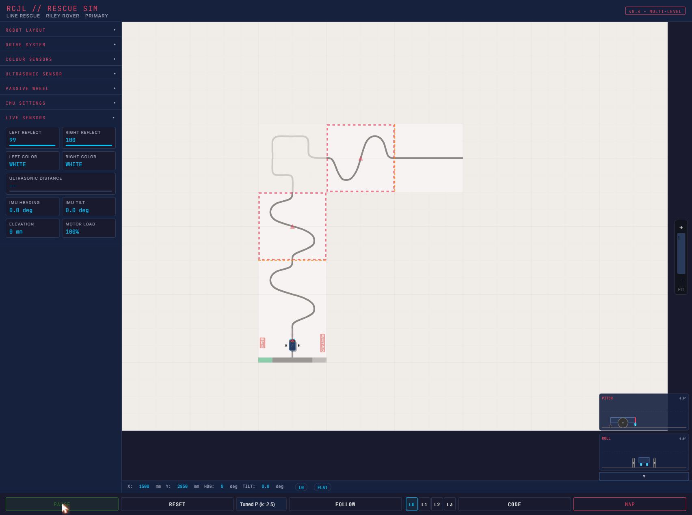
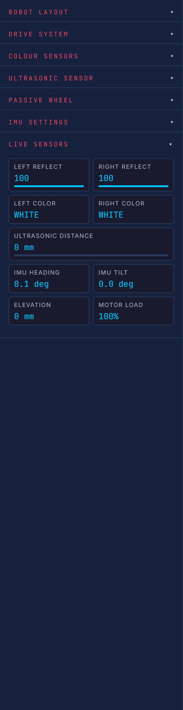
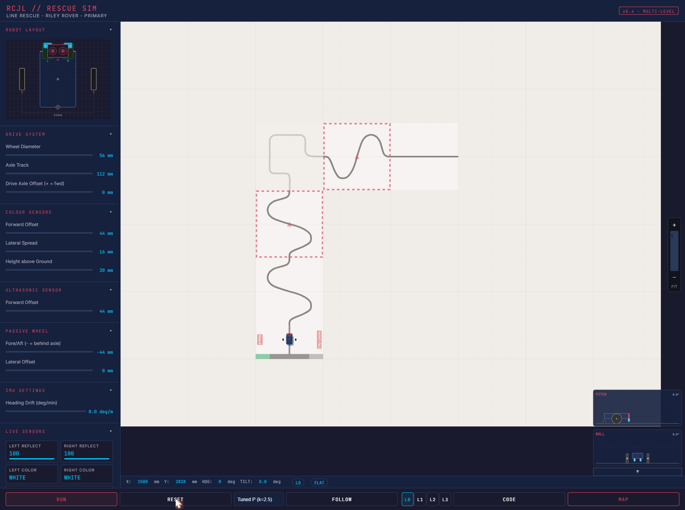
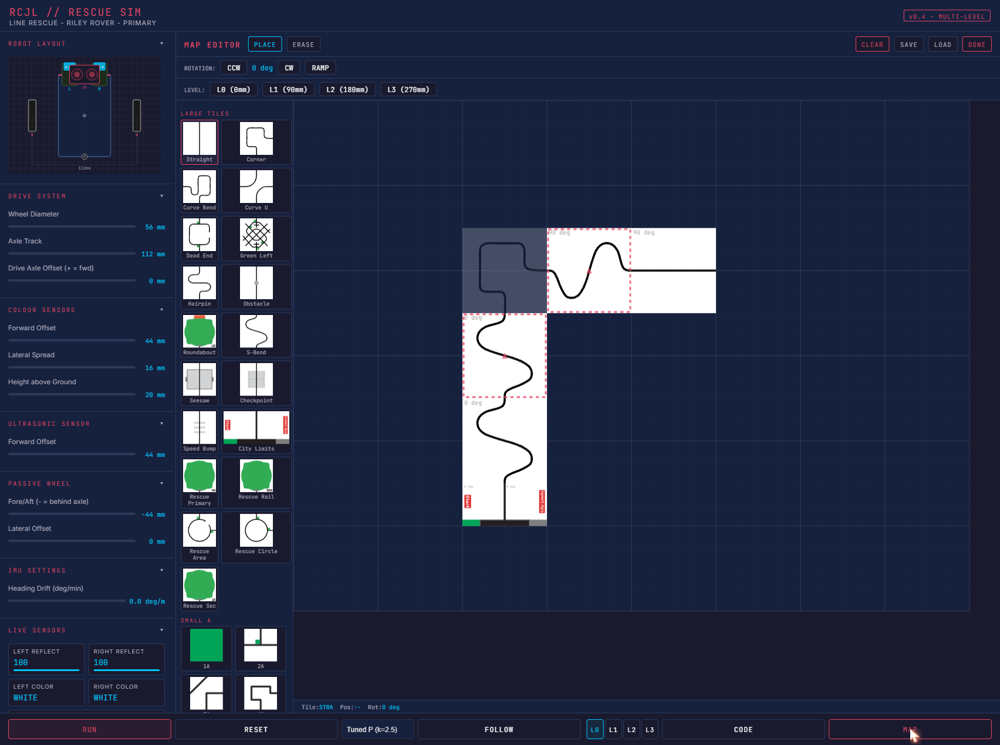
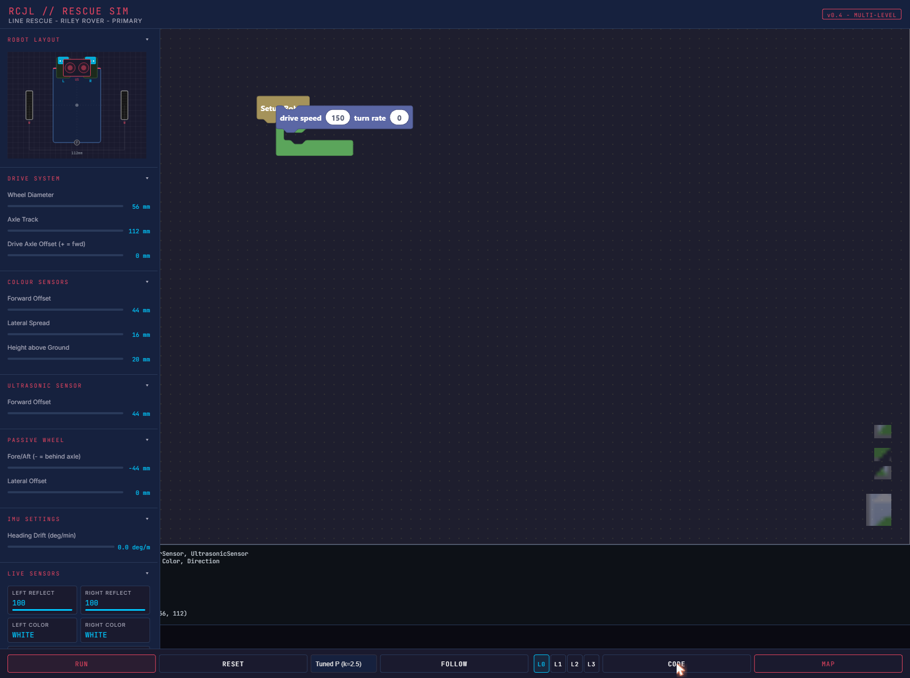
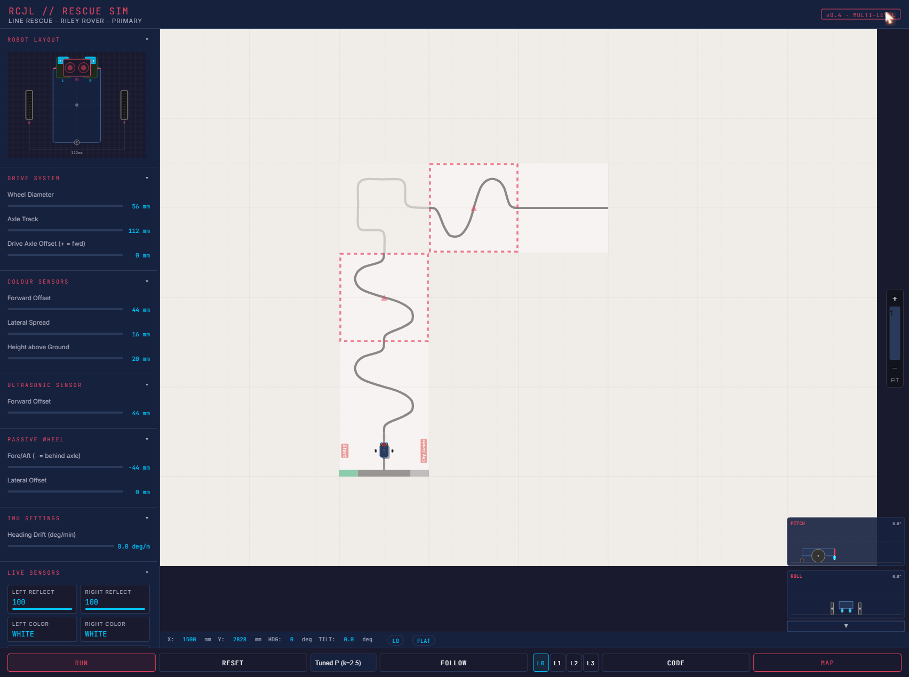

# RCJL Rescue Simulator — User Manual

## 1. Welcome

The **RCJL Rescue Simulator** is a browser-based tool that lets you design, test, and tune line-following robots for RoboCup Junior Line Rescue competitions. You can configure your robot's physical dimensions to match your real LEGO Spike Prime build, lay out competition-style arenas with ramps and multi-level tracks, and write control programs using a visual block editor — all without needing a physical robot on hand.

**Requirements:**

- A modern desktop browser (Chrome, Edge, or Firefox recommended)
- Screen resolution of at least 1280 × 800
- No installation needed — the simulator runs entirely in the browser

**Getting started:** Open `robocup-simulator.html` in your browser, either from a local copy or the hosted GitHub Pages URL. The simulator loads immediately with a default arena and robot configuration.

---

## 2. Interface Overview

The simulator interface is divided into four main areas:

| Area | Location | Purpose |
|---|---|---|
| **Left Panel** | Left side | Robot configuration sliders, live sensor readouts |
| **Arena Canvas** | Centre | The competition field — where your robot drives |
| **Status Bar** | Bottom of arena | Robot position, heading, tilt, level, ramp state |
| **Control Bar** | Bottom edge | RUN/RESET, demo mode selector, FOLLOW, level view, CODE/MAP buttons |
| **PiP Views** | Bottom-right corner | Pitch and Roll diagrams showing robot tilt on ramps |

### Left Panel Sections

The left panel contains collapsible sections (click the section header to expand/collapse):

- **Robot Layout** — A top-down diagram showing your robot's wheel positions, sensors, and body outline
- **Drive System** — Wheel diameter, axle track, drive axle offset
- **Colour Sensors** — Forward offset, lateral spread, height above ground
- **Ultrasonic Sensor** — Forward offset
- **Passive Wheel** — Fore/aft position and lateral offset
- **IMU Settings** — Heading drift rate
- **Live Sensors** — Real-time sensor readings while the simulation runs

---

## 3. Setting Up Your Robot

Match the simulator's sliders to your real robot's measurements. This ensures the simulated behaviour closely reflects how your physical robot will perform.

### Drive System

| Slider | Range | Default | What it means |
|---|---|---|---|
| Wheel Diameter | 30–90 mm | 56 mm | The diameter of your drive wheels. Larger wheels cover more ground per motor rotation. |
| Axle Track | 56–160 mm | 112 mm | Distance between the centres of your two drive wheels. A wider track makes the robot more stable but turns in a larger arc. |
| Drive Axle Offset | -40 to +40 mm | 0 mm | Shifts the drive axle forward (+) or backward (-) relative to the robot's centre. This changes how the robot pivots and affects steering feel. |

### Colour Sensors

| Slider | Range | Default | What it means |
|---|---|---|---|
| Forward Offset | 0–80 mm | 44 mm | How far ahead of the robot's centre the colour sensors sit. Further forward gives earlier line detection but more overshoot on curves. |
| Lateral Spread | 8–60 mm | 16 mm | Distance between the two colour sensors (left and right of centre). Wider spread detects the line edge sooner but may miss thin lines. |
| Height above Ground | 5–40 mm | 20 mm | How high the sensor face sits above the ground. Lower is more accurate. Too high and the sensor loses the line on ramps (see Section 8). |

### Ultrasonic Sensor

| Slider | Range | Default | What it means |
|---|---|---|---|
| Forward Offset | 20–100 mm | 44 mm | How far ahead the ultrasonic distance sensor is mounted. |

### Passive Wheel

| Slider | Range | Default | What it means |
|---|---|---|---|
| Fore/Aft | -44 to +44 mm | -44 mm | Position of the passive (caster) wheel. Negative values place it behind the drive axle, which is the typical configuration. |
| Lateral Offset | -28 to +28 mm | 0 mm | Side-to-side offset of the caster wheel. Usually centred (0). |

### IMU Settings

| Slider | Range | Default | What it means |
|---|---|---|---|
| Heading Drift | 0–5 deg/min | 0 | Simulates gyroscope drift. Real IMUs drift over time — increase this to test how well your code handles it. |

### The Robot Layout Diagram

The diagram at the top of the left panel shows a top-down view of your robot. It updates live as you adjust sliders:

- **Blue rectangle** — the hub body
- **Dark rectangles on the sides** — drive wheels
- **Small circle** — passive wheel
- **Red circles** — colour sensors (left and right)
- **Cyan arc** — ultrasonic sensor beam
- **Dimension line** — shows the axle track width

Use this diagram to verify your configuration matches your physical robot before running the simulation.

---

## 4. Running the Simulation

### Start, Stop, and Reset

- **RUN** — Starts the simulation. The robot begins moving according to the selected mode.
- **RESET** — Stops the simulation and returns the robot to its starting position (the green drop zone on the map).

### Demo Modes

The dropdown next to RESET lets you choose how the robot drives:

| Mode | Description |
|---|---|
| **Tuned P (k=2.5)** | A proportional line follower with a well-tuned gain. Good for testing maps. |
| **Basic P (k=1.0)** | A gentler proportional controller — the robot follows the line but reacts more slowly. |
| **Bang-Bang** | A simple on/off controller — the robot snaps between full left and full right turns. Demonstrates why proportional control matters. |
| **Use Code** | Runs your custom block program (see Section 7). |

### Reading the Live Sensor Panel

While the simulation runs, the **Live Sensors** section shows real-time values:

- **Left/Right Reflect** — Reflection values (0 = black, 100 = white) from each colour sensor
- **Left/Right Color** — Detected colour name (BLACK, WHITE, RED, GREEN, or NONE)
- **Ultrasonic Distance** — Distance to the nearest obstacle in mm (or `--` if nothing detected)
- **IMU Heading** — Current heading angle in degrees
- **IMU Tilt** — Body tilt angle on ramps
- **Elevation** — Robot height above the base level
- **Motor Load** — Current motor effort as a percentage

### Stall Warning

If the robot's colour sensor physically collides with the ground (for example, if the sensor is mounted very low and the robot approaches a ramp at a steep angle), the robot will **stall**. When stalled:

- The robot body turns red on the arena
- A red **"STALLED — Sensor Ground Collision"** warning appears in the sensor panel
- The robot cannot move forward until conditions change

To fix a stall, try raising the sensor height or adjusting the drive axle offset in the configuration sliders.

---

## 5. Navigating the Arena

### Zoom

- **Scroll wheel** on the arena canvas to zoom in/out
- **+** / **−** buttons on the right edge
- **Zoom slider** on the right edge for fine control
- **FIT** button to reset the view to show the entire arena

### Pan

- **Middle-click and drag** on the arena to pan the view
- The view resets when you click FIT

### Follow Mode

Click **FOLLOW** in the control bar to lock the camera on the robot. The view will track the robot as it moves. Click again to unlock.

### Level View

The **L0**, **L1**, **L2**, **L3** buttons in the control bar switch which level of the arena is displayed. On multi-level maps with ramps, tiles exist on different levels:

- **L0** — Ground level (0 mm)
- **L1** — First level (90 mm)
- **L2** — Second level (180 mm)
- **L3** — Third level (270 mm)

### Status Bar

The bar below the arena shows the robot's current state:

| Field | Meaning |
|---|---|
| **X / Y** | Robot position in mm |
| **HDG** | Heading in degrees (0 = north/up, 90 = east/right, clockwise positive) |
| **TILT** | Body tilt angle on ramps |
| **L0–L3** | Current level indicator |
| **FLAT / RAMP** | Whether the robot is on flat ground or a ramp slope |

---

## 6. Building Maps with the Map Editor

### Opening the Editor

Click the **MAP** button (bottom-right, highlighted in red) to open the map editor. The arena canvas switches to editor mode, and a tile palette appears on the left.

### The Tile Palette

Tiles are organised into five groups:

| Group | Count | Size | Description |
|---|---|---|---|
| **Large Tiles** | 19 | 4×4 cells | Full competition tiles — straights, curves, intersections, gaps, speed bumps |
| **Small A** | 28 | 2×2 cells | Quarter-size tiles for detailed track sections |
| **Small B** | 28 | 2×2 cells | Additional quarter-size tile variants |
| **Ramps** | 8 | 2×2 cells | Ramp tiles that connect different levels |

Click a tile in the palette to select it, then click on the arena grid to place it.

### Editor Tools

| Button | Action |
|---|---|
| **PLACE** | Click the grid to place the selected tile |
| **ERASE** | Click a grid cell to remove a tile |
| **CLEAR** | Remove all tiles from the current level |
| **CCW / CW** | Rotate the selected tile counter-clockwise / clockwise before placing |
| **RAMP** | Toggle ramp mode — when active, placed tiles are marked as ramp transitions |

### Working with Levels

Use the level buttons (**L0**, **L1**, **L2**, **L3**) in the editor to switch which level you're editing. Ramp tiles connect adjacent levels — place a ramp on the lower level, and the connecting track on the upper level.

Each level sits 90 mm above the previous one, matching the RoboCup Junior competition standard.

### Drop Zones

The drop zone (marked with a green highlight on the map) is where the robot starts when you click RUN. To change the start position, look for drop zone tiles in the tile palette.

### Save and Load Maps

- **SAVE** — Opens a dialog to save your map:
  - **FILE** — Downloads the map as a JSON file to your computer
  - **LOCAL** — Saves to browser localStorage (persists between sessions)
- **LOAD** — Opens a dialog to load a map:
  - **FILE** — Upload a JSON file from your computer
  - **LOCAL** — Load from browser localStorage
  - **PASTE** — Paste a JSON string directly
- **DONE** — Close the map editor and return to simulation mode

---

## 7. Programming Your Robot with Blocks

### Opening the Code Editor

Click the **CODE** button in the control bar to open the block-based code editor. A Blockly workspace appears where you can drag and snap blocks together to build your program.

### Block Categories

The toolbox on the left side of the code editor organises blocks into categories:

| Category | Blocks | Purpose |
|---|---|---|
| **Setup** | Pybricks Setup | Initialise your robot's hub, motors, and sensors. Every program needs this block. |
| **DriveBase** | Drive, Straight, Turn, Arc, Stop, Brake, Reset, Distance, Angle, Stalled, Done, Settings, Use Gyro | Control the robot's movement — drive at a speed, go straight, turn, follow arcs, and read odometry. |
| **Motors** | Run, Stop, Brake, Hold, Run Time, Run Angle, Reset Angle, Angle, Speed, Stalled | Control individual motors directly for fine-grained movement. |
| **Sensors** | Reflection, Color, HSV, Ambient, Color Constant, Ultrasonic Distance | Read sensor values — reflection intensity, detected colour, distance to obstacles. |
| **IMU** | Heading, Reset, Tilt, Acceleration, Angular Velocity, Stationary | Read the inertial measurement unit — heading angle, tilt, and motion state. |
| **Timing** | Wait, Stopwatch Time/Reset/Pause/Resume, Print | Add delays, measure elapsed time, and print debug messages to the console. |
| **Logic** | If/Else, Compare, And/Or, Not, True/False | Make decisions based on sensor readings. |
| **Loops** | Forever, Repeat, While/Until, For | Repeat actions — the core of any line-following algorithm. |
| **Math** | Number, Arithmetic, Functions, Round, Random | Perform calculations for PID controllers and other algorithms. |
| **Variables** | Create/Set/Get variables | Store and retrieve values like sensor thresholds or PID terms. |
| **Text** | Text, Join, Print | Build text strings for console output and debugging. |

### Building a Simple Line Follower

Here's a step-by-step example of a basic proportional line follower:

1. Drag a **Setup** block onto the workspace
2. From **Loops**, drag a **forever** loop and attach it below Setup
3. Inside the loop:
   - From **Sensors**, add two **reflection** blocks (set one to Left, one to Right)
   - From **Math**, calculate the error: `left_reflection - right_reflection`
   - From **DriveBase**, add a **drive** block
   - Set speed to a number (e.g., 150)
   - Set turn rate to: `error × 2.5` (using Math multiply)
4. This creates a proportional controller — the robot steers toward whichever sensor sees more black

### Viewing Generated Python

The code editor shows a Python preview of your block program. This is the Pybricks-compatible Python code that corresponds to your blocks. You can use this to learn Python syntax or transfer your program to a real Spike Prime hub.

### Running Your Code

1. Build your block program in the code editor
2. Click **DONE** to close the editor
3. Select **"Use Code"** from the demo mode dropdown
4. Click **RUN**

The console area below the code editor displays any `print()` output and error messages from your program.

### Save and Load Programs

- **SAVE** — Save your block program:
  - **FILE** — Downloads as an XML file
  - **LOCAL** — Saves to browser localStorage
- **LOAD** — Load a block program:
  - **FILE** — Upload an XML file
  - **LOCAL** — Load from browser localStorage
  - **PASTE** — Paste XML directly
- **COPY** — Copy the generated Python code to your clipboard

---

## 8. Understanding the Sensors

### Reflection Sensor (0–100)

The colour sensor's reflection mode returns a value from 0 (pure black) to 100 (pure white). In the simulator:

- Black lines read close to **0**
- White background reads close to **100**
- Green markers read around **40–50**
- Red markers read around **30–40**
- The exact values vary slightly due to simulated sensor noise

### Colour Detection

The colour sensor can identify five colours:

| Colour | Typical use on the field |
|---|---|
| **BLACK** | The line to follow |
| **WHITE** | Background / tile surface |
| **RED** | Warning markers, intersections |
| **GREEN** | Turn indicators, checkpoints |
| **NONE** | Sensor cannot determine colour (too far from surface) |

### Ultrasonic Distance

Returns the distance in millimetres to the nearest obstacle ahead of the robot. The sensor fires a single ray forward from the ultrasonic sensor position. Returns `--` when no obstacle is within range.

### IMU (Inertial Measurement Unit)

- **Heading** — The robot's compass direction in degrees. Resets to the starting heading or can be reset in code.
- **Tilt** — The body's tilt angle when on a ramp. 0 on flat ground.

### How Sensors Change on Ramps

When the robot drives onto a ramp, the body tilts. If the colour sensors are mounted ahead of the drive axle, they may lift away from the surface or project over a different level. As the sensor rises:

1. **Small lift (1–2 mm)** — Readings become slightly noisier but still usable
2. **Moderate lift (3–4 mm)** — Black and white readings start blending together; line detection becomes unreliable
3. **Large lift (4+ mm)** — The sensor effectively goes blind; both readings converge to the background colour. Colour detection returns **NONE**.

This behaviour is realistic — real colour sensors lose accuracy when lifted away from the surface.

**Tips for handling ramps:**
- Keep the sensor height as low as practical (but not so low it causes a stall)
- Use the IMU tilt reading to detect when you're on a ramp
- Consider slowing down on ramps to give your program more time to react
- The drive axle offset affects how much the sensor lifts on ramp transitions — experiment with different values

---

## 9. Physics Simulation — Capabilities and Limitations

### What it simulates

- **Differential drive steering** — Two motors control left and right wheels independently, giving realistic turning behaviour
- **Body tilt on ramps** — The robot body tilts realistically based on three contact points (two drive wheels and one passive wheel)
- **Sensor degradation on ramps** — Colour sensor readings degrade as the sensor lifts away from the surface, matching real-world behaviour
- **Sensor ground collision** — If the sensor is mounted too low, it can collide with the ground on ramp transitions, stalling the robot
- **Ramp speed changes** — The robot moves slower uphill and faster downhill
- **IMU heading with optional drift** — Simulates gyroscope behaviour including configurable drift over time
- **Ultrasonic distance sensing** — Detects obstacles ahead of the robot

### What it simplifies

- **No momentum or inertia** — The robot starts and stops instantly (real robots coast)
- **No wheel slip or friction** — Wheels always grip perfectly
- **No gravity-based ramp physics** — Speed changes on ramps use a fixed factor rather than calculating forces
- **No obstacle collision** — The robot passes through obstacles (ultrasonic detects them, but there's no physical blocking)
- **Basic ultrasonic** — Uses a single ray, not a realistic sound cone
- **Simplified colour detection** — Only five colours (real sensors detect more)
- **Single robot** — No multi-robot scenarios

### What this means for your real robot

The simulator is a great tool for developing and testing algorithms, but your real robot will behave differently in several ways:

- **Real robots have momentum** — They coast when you stop the motors, so you'll need to account for braking distance
- **Real ramp speeds depend on weight and friction** — Your actual uphill/downhill speeds will differ from the simulator
- **Real sensor noise is different** — Ambient light, surface texture, and battery level all affect real sensors
- **Test obstacle avoidance on a real field** — The simulator can detect obstacles but doesn't physically block the robot

Use the simulator to get your algorithms working, then fine-tune the parameters on your real robot.

---

## 10. Tips and Troubleshooting

### Common Problems

| Problem | Likely Cause | Fix |
|---|---|---|
| Robot doesn't move | Simulation not started | Click **RUN** |
| Robot doesn't move | "Use Code" selected but no program loaded | Switch to a demo mode, or open CODE and build a program |
| Robot goes off the line | PID gain too low or too high | Adjust the turn rate multiplier in your code. Try demo modes to see working values. |
| Robot turns the wrong way | Left/right sensor or motor mapping is inverted | Check your code's sensor-to-steering logic |
| Robot stalls on ramp | Sensor mounted too low | Increase **Height above Ground** in Colour Sensors |
| Robot stalls on ramp | Drive axle offset pushing sensor into ground | Adjust **Drive Axle Offset** toward 0 or positive values |
| Robot loses line on ramp | Sensor too high — readings degrade | Lower **Height above Ground** (but not so low it stalls) |
| Colour detection returns NONE | Sensor too far from surface | Check sensor height; the robot may be tilted on a ramp |
| Map won't load | Wrong file format | Maps use JSON format — make sure you're loading a `.json` file |
| Code won't run | Missing Setup block | Every program needs the **Pybricks Setup** block at the top |
| Console shows errors | Block program has issues | Read the error message — common issues are missing sensor definitions or using blocks outside a loop |

### Saving Your Work

- **Robot configuration** — Automatically saved to browser localStorage. Your slider settings persist between sessions.
- **Maps** — Must be saved manually (FILE or LOCAL). Use FILE to download a portable JSON backup.
- **Block programs** — Must be saved manually (FILE or LOCAL). Use FILE to download a portable XML backup.

**Tip:** Save your maps and programs to files regularly. Browser localStorage can be cleared if you clear your browser data.

---

## 11. Quick Reference

### Control Bar

| Button | Action |
|---|---|
| **RUN** | Start the simulation |
| **RESET** | Stop and return robot to start position |
| **FOLLOW** | Toggle camera follow mode |
| **L0–L3** | Switch visible arena level |
| **CODE** | Open/close the block code editor |
| **MAP** | Open/close the map editor |

### Navigation

| Action | How |
|---|---|
| Zoom in/out | Scroll wheel, or **+** / **−** buttons |
| Pan | Middle-click and drag |
| Reset view | Click **FIT** |
| Follow robot | Click **FOLLOW** |

### All Configuration Parameters

| Parameter | Section | Min | Max | Default | Unit |
|---|---|---|---|---|---|
| Wheel Diameter | Drive System | 30 | 90 | 56 | mm |
| Axle Track | Drive System | 56 | 160 | 112 | mm |
| Drive Axle Offset | Drive System | -40 | 40 | 0 | mm |
| Forward Offset | Colour Sensors | 0 | 80 | 44 | mm |
| Lateral Spread | Colour Sensors | 8 | 60 | 16 | mm |
| Height above Ground | Colour Sensors | 5 | 40 | 20 | mm |
| Forward Offset | Ultrasonic | 20 | 100 | 44 | mm |
| Fore/Aft | Passive Wheel | -44 | 44 | -44 | mm |
| Lateral Offset | Passive Wheel | -28 | 28 | 0 | mm |
| Heading Drift | IMU | 0 | 5 | 0 | deg/min |

### Sensor Value Ranges

| Sensor | Range | Notes |
|---|---|---|
| Reflection | 0–100 | 0 = black, 100 = white |
| Colour | BLACK, WHITE, RED, GREEN, NONE | NONE when sensor is too far from surface |
| Ultrasonic | 0–2550 mm | `--` when no obstacle detected |
| IMU Heading | 0–360 deg | Clockwise positive, 0 = starting direction |
| IMU Tilt | degrees | 0 on flat ground, positive on ramps |
| Elevation | mm | Height above base level |
| Motor Load | 0–100% | Current motor effort |

### Tile Categories

| Category | Tile Size | Count | Use for |
|---|---|---|---|
| Large Tiles | 4×4 cells | 19 | Main competition tiles — straights, curves, intersections |
| Small A | 2×2 cells | 28 | Detailed track sections |
| Small B | 2×2 cells | 28 | Additional track variants |
| Ramps | 2×2 cells | 8 | Level transitions (connect L0↔L1, L1↔L2, etc.) |

### Block Categories Quick Reference

| Category | Key Blocks |
|---|---|
| Setup | Pybricks Setup (required in every program) |
| DriveBase | drive, straight, turn, arc, stop, stalled, settings |
| Motors | run, stop, brake, hold, run_time, run_angle, stalled |
| Sensors | reflection, color, hsv, ambient, ultrasonic_distance |
| IMU | heading, reset, tilt, acceleration, stationary |
| Timing | wait, stopwatch, print |
| Logic | if/else, compare, and/or, not |
| Loops | forever, repeat, while/until, for |
| Math | number, arithmetic, functions, round, random |
| Variables | create, set, get |
| Text | text, join, print |
